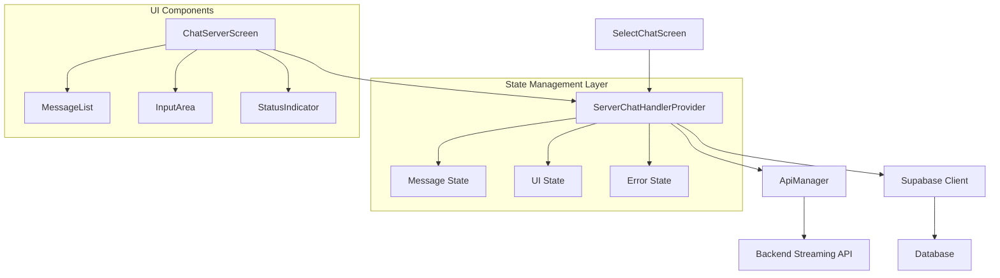

# Design Document

## Overview

This design addresses the alignment and integration issues in the Flutter AI chatbot application. The solution focuses on improving state management, fixing UI inconsistencies, enhancing error handling, and ensuring proper communication flow between the chat selection screen, active chat screen, and the backend streaming API.

## Architecture

### Current Architecture Analysis

The current implementation has several architectural strengths and weaknesses:

**Strengths:**
- Uses Provider pattern for state management
- Implements proper separation between UI and business logic
- Has streaming response handling capability
- Uses Supabase for data persistence

**Issues Identified:**
1. Inconsistent navigation patterns between screens
2. Potential memory leaks with controller management
3. Missing error boundaries and recovery mechanisms
4. Incomplete streaming response handling
5. UI state synchronization issues during streaming

### Proposed Architecture Improvements



## Components and Interfaces

### 1. Enhanced ServerChatHandlerProvider

**Responsibilities:**
- Manage conversation state and message history
- Handle streaming API communication
- Provide UI state management
- Implement error handling and recovery

**Key Improvements:**
- Better lifecycle management for controllers
- Enhanced error handling with retry mechanisms
- Improved streaming response parsing
- Proper state cleanup between conversations

### 2. Improved Navigation Flow

**SelectChatScreen Enhancements:**
- Consistent navigation using proper routing
- Better state cleanup when switching conversations
- Improved error handling for conversation operations

**ChatServerScreen Enhancements:**
- Better message list rendering with proper state handling
- Enhanced input area with improved send button logic
- Proper streaming response visualization

### 3. Message Handling System

**Message Flow:**
1. User input validation and preprocessing
2. Local message addition for immediate UI feedback
3. Database persistence of user message
4. API request initiation with proper headers
5. Streaming response handling with status updates
6. Final message persistence and UI updates

## Data Models

### Enhanced ChatMessage Model

```dart
class ChatMessage {
  final String id;
  final int conversationId;
  final String userId;
  final String sender;
  final String message;
  final DateTime createdAt;
  final MessageStatus status; // New field for message status
  
  // Additional methods for better state management
}

enum MessageStatus {
  sending,
  sent,
  delivered,
  failed
}
```

### UI State Management

```dart
class ChatUIState {
  final bool isLoading;
  final bool isSending;
  final String status;
  final String? error;
  final bool canSend;
  
  // Methods for state transitions
}
```

## Error Handling

### Error Categories and Handling

1. **Network Errors:**
   - Connection timeouts
   - Server unavailability
   - Authentication failures
   - Retry mechanisms with exponential backoff

2. **Data Errors:**
   - Invalid conversation IDs
   - Message parsing failures
   - Database constraint violations
   - Graceful degradation strategies

3. **UI Errors:**
   - Controller disposal issues
   - State synchronization problems
   - Navigation stack corruption
   - Proper cleanup and recovery

### Error Recovery Strategies

- Automatic retry for transient network errors
- Fallback to cached data when possible
- User-friendly error messages with action buttons
- Proper state restoration after errors

## Testing Strategy

### Unit Tests

1. **Provider Tests:**
   - State management logic
   - Message handling workflows
   - Error handling scenarios
   - Controller lifecycle management

2. **Model Tests:**
   - Data serialization/deserialization
   - Validation logic
   - State transitions

### Integration Tests

1. **Navigation Flow Tests:**
   - Screen transitions
   - State preservation
   - Provider integration

2. **API Integration Tests:**
   - Streaming response handling
   - Error scenarios
   - Authentication flow

### Widget Tests

1. **UI Component Tests:**
   - Message bubble rendering
   - Input area functionality
   - Loading states
   - Error state displays

## Implementation Approach

### Phase 1: Core Fixes
- Fix controller lifecycle management
- Improve error handling in provider
- Enhance streaming response parsing
- Fix navigation consistency

### Phase 2: UI Enhancements
- Improve message list rendering
- Enhance status indicators
- Better loading states
- Improved error displays

### Phase 3: Polish and Optimization
- Performance optimizations
- Enhanced user experience
- Additional error recovery
- Code cleanup and documentation

## Key Design Decisions

1. **State Management:** Continue using Provider pattern but with enhanced error handling and lifecycle management

2. **Navigation:** Use consistent navigation patterns with proper state cleanup

3. **Streaming Handling:** Improve the current streaming implementation with better error handling and status management

4. **Error Recovery:** Implement comprehensive error handling with user-friendly recovery options

5. **Performance:** Optimize message list rendering and state updates for better performance

## Security Considerations

- Proper token management for API requests
- Input validation and sanitization
- Secure storage of conversation data
- Protection against injection attacks

## Performance Considerations

- Efficient message list rendering with proper ListView optimization
- Debounced state updates during streaming
- Memory management for large conversation histories
- Proper disposal of resources and controllers